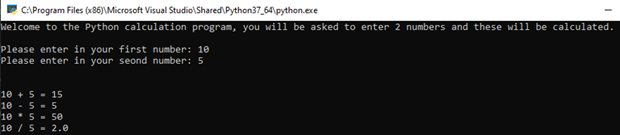

# Week 01: VARIABLES AND ARITHMETIC
This week within programming sessions, you have been working on learning the following:
1. Input/Output within Python
2. Appropriate use of Variables
3. Approaches to Problem Solving
4. Arithmetic Operators within Python

# Task 01: Calculator
Making use of inputs and variables, create a calculator program which allows for numbers to be entered and for a range of calculations to be completed on each. The following slides will provide the input, processing and output required to **decompose** this program.

## Inputs
- First Number
- Second Number

## Processing
- Addition
- Subtraction
- Division
- Multiplication

## Outputs
- First Numb + Second Numb = Output
- First Numb - Second Numb = Output
- First Numb / Second Numb = Output
- First Numb * Second Numb = Output

## Example Output
An example output has been provided below: 

# Task 02: The Yummy Gummies Shop 
A new shop has opened which sell the prestigious delicacy that is "Yummy Gummies".  

They would like a new program created that asks the user how many “Yummy Gummies” they would like to purchase. The next slide provides context as to what they are looking for:

## Yummy Gummies Requirements
1. How much the users' total purchase will cost – Yummy Gummies cost £0.50 each (without VAT) 
2. Display the VAT that would be added on top of the purchase cost (20%) 
3. Display the total that the user would need to pay (Purchase Cost + VAT)