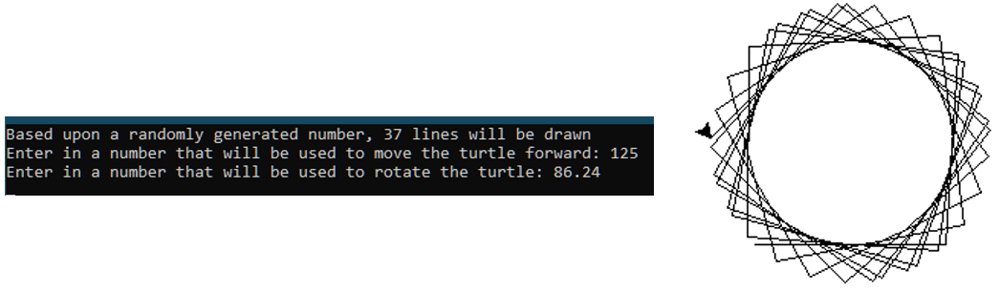
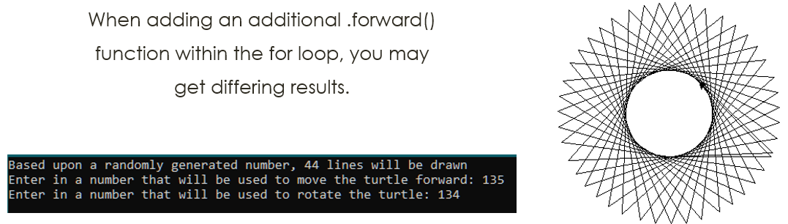
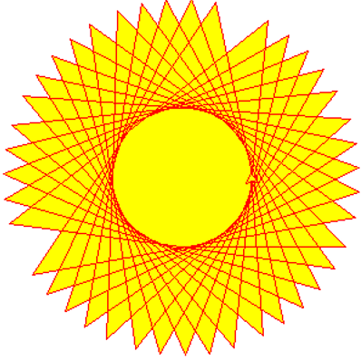

# Turtles Challenges
The following task will combine together the resources from the past few weeks, you will need to do the following:

1. Ask the user for a number input, this will represent an amount of degrees (they can choose between 0 - 360)
2. Ask the user for another number input, this will represent the number of pixels to move the turtle forward

Generate a random number, put this as the end number within a FOR loop and have this start at 0 and increment by 1. 
Inside of the for loop, input code that uses the degree amount entered by the user (rotate left) and move the turtle forward. This will be used to generate a random shape based upon the numbers that the user inputs.

The below provide some example outputs that can be used for this:

## Example Output 1

## Example Output 2

> You may want to consider adding colour to the shape that is created:

# Extension Task
Following on from the above program, add in code to validate whether the number entered within the degrees box is smaller than 0 or larger than 360. If this is the case, then get the user to re-enter the number, otherwise run the program as normal.