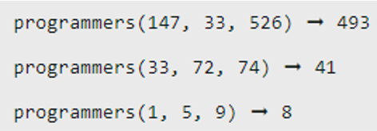
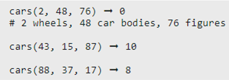

# Week 04 - Functions
These challenges will look at making use of the functions within Python.

## Task 01: The 3 Programmers Problem
You hired three programmers and you (hopefully) pay them. Create a function that takes three numbers (the hourly wage of each programmer) and returns the difference between the highest-paid programmer and the lowest-paid. Example output has been provided below:

## Task 02: Toy Car Workshop
You work in a toy car workshop, and your job is to build toy cars from a collection of parts. Each toy car needs 4 wheels, 1 car body, and 2 figures of people to be placed inside. Given the total number of wheels, car bodies and figures available, how many complete toy cars can you make?
